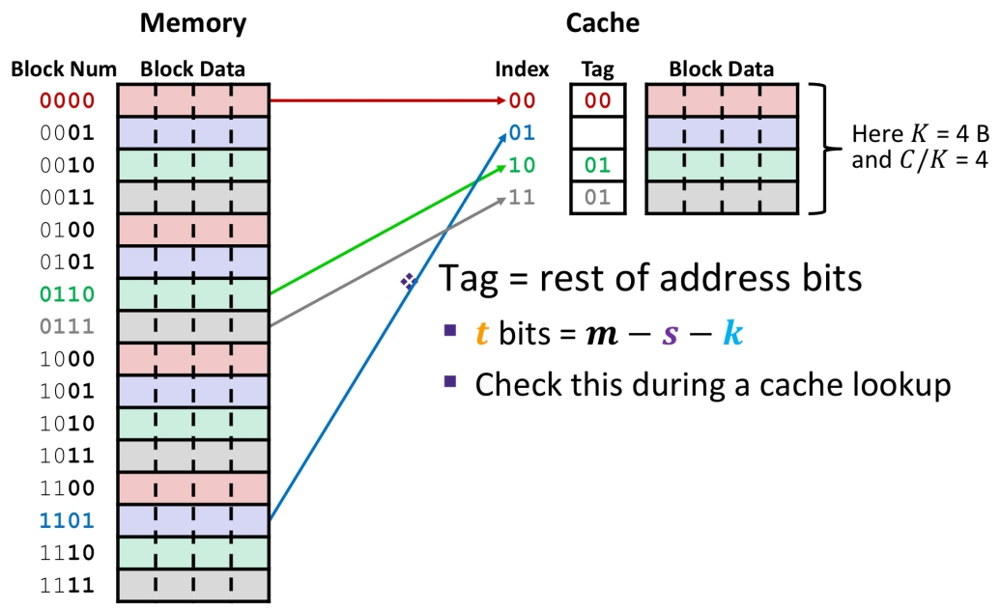

# Cache

**Block size**: how many bytes there are in each block (a terminology in memory), divide memory address into blocks

**Cache size**: is given in units of bytes or units of blocks, how many bytes or blocks in cache

if block size = K, the ***Block number** = A/K*, the ***Block offset** = A%K*

Some matrics: 

average memory access time(AMAT), hit time(HT), miss penalty(MP)

### Direct-Mapped Cache Placement

in order to reduce AMAT

use a hash function

*index of cache = block num % cache size* （modulus多少就能分成多少类）

### Cache access

Memory address breakdown:

s and k are calculated with parameters first, then t = m-s-k

**Tag**: differentiate blocks in the same index.

​	比如00**10**和01**10**都会map到index为10的cache里，但是为了区分它们的话需要额外用Tag存00和01。

However, when we access 8, 24, 8, 24, both of them are in the green block (same index) with different tag, miss miss misssss...... No temporal locality!

### Solution: Associativity (E)

Such a cache is called "E-way set associative cache".

​	In 1-way/direst-mapped, it's fixed. **Each adress maps to exactly one set and each set can only give one way within the set to store a block.**

So if we can store adress in any place in the cache?:

​	In 2-way, we can put 00**10** and 01**10** in one set, which deals with the cats-and-dogs problem. 0010 has 2 ways to be stored in cache.

The value of E change the bit size: **(increasing associativity is increasing blocks mapped to one index)**

Replacement will still happen in cache.

To make sure we can use any empty block in the correct set, We need 1 more bit for indicating is data is valid(1) or mystery(0) ------ **Valid bit**.

A terminology in replacement: LRU(least recently used), 即如果set里都满了，优先替换LRU数据

### **General Cache Organization**

Index helps to find which row (set), and ~~hardware~~ tag helps to find which column(block in set).

### 3 Types of Cache Misses

Compulsory(cold) miss

Conflict miss

Capacity miss

