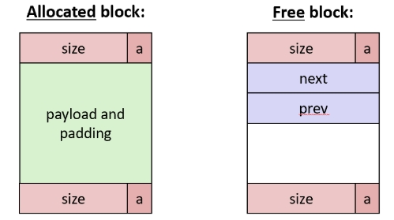

# Memory Allocation

At the top of heap: %brk ptr

Good practices: 

​	int* ptr = (int*) malloc(n * sizeof(int));

​	void free(void* p); p = NULL; // <!--p still point to deallocated memory after free, good to set p = NULL after freeing-->

Another two functions:

​	void* realloc(void* ptr, size_t size): change the size of preciously allocated block

​	void sbrk(intptr_t increment): used to grow or shrink the heap

word is 64bits = 8 bytes

### Performance Goals

utilization = aggregate payload / heap size  // so go fast and think carefully

Fragmentation

​	internal

​	external

### How Much to Free?

an extra word for every allocated block: indicates block size--payload+8 !instead of payload!

but returned address still point to the start of payload

### Keep track of Free Blocks?

1st way: **<u>implicit free list</u>**, using math, not using pointers. Like adding the block size stored in the header word

​	In header(1 word in total): size + is-allocated flag(1 bit)     this 1 bit is really a trick because the lowest bit is always 0

​	So when reading size, remember to mask out this flag bit

​	**Alignment**

2nd way: **<u>explicit free list</u>**

​	Boundary tags(header+footer) + payload + padding

​	or for Free block: Boundary tags + next ptr + prev ptr -----> Free List

​		Logically: doubly-linked list

​		Physically: blocks can in any order

​	

​	

3rd way: segregated free list

4st way: blocks sorted by size

### Find a Free Block

**First fit**: search list from beginning, choose the first-fit free block

​	While ( (p<end) && ( (*p & 1) || (*p <= len) ) ) {

​		p = p + (*p &-2);

​	}

**Next fit**: search list starting where previous search finished 

**Best fit**: search the best --> large enough 且 less fragment

What if we have a free block larger than we need?: <u>**Splitting**</u>

After free, <u>**Coalesce**</u> thefree block

Then how to coalesce the preceding block?: Use double boundary tags to traverse backwards.